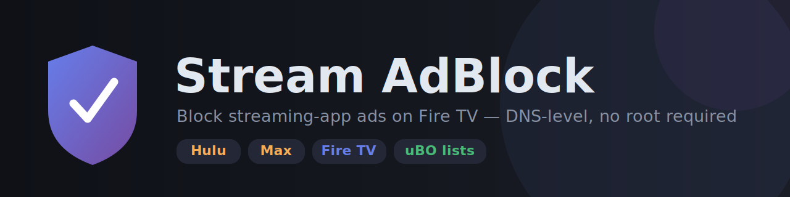
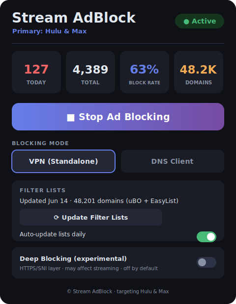
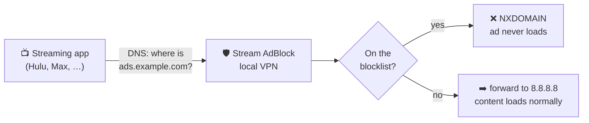

<p align="center">
  
</p>

<p align="center">
  <a href="https://github.com/deepak-glitch/adblock/actions/workflows/firetv-build.yml"></a>
  
  
  <a href="https://github.com/deepak-glitch/adblock/releases/tag/firetv-latest"></a>
  
</p>

<p align="center">
  <b>Block ads and trackers on Hulu, Max, and every other app on your Fire TV — at the DNS level, with no root and no computer needed.</b>
</p>

---

## ✨ What it does

Stream AdBlock runs a tiny **on-device VPN** on your Fire TV that intercepts DNS
and blocks ad / tracker hosts for **every app**, not just a browser. Highlights:

- 📺 **Works inside native apps** (Hulu, Max, Peacock, Tubi, Pluto…) — not just web pages.
- 🛡️ **300+ hand-tuned ad/tracker domains** out of the box, plus optional **live uBlock Origin + EasyList** updates (tens of thousands more).
- 🍿 **Cuts Max ads** via the community [HBO-Ads](https://github.com/ajstrick81/HBO-Ads) DNS recipe (blocks ad-segment hosts, keeps the playback API alive).
- 🚫 **No root, no PC, no subscription.** Sideload one APK and tap Start.
- 🔒 **Private:** no telemetry, no accounts. The only network calls are the DNS you choose to allow.

<p align="center">
  
</p>

---

## 📲 Install on Fire TV (≈ 2 minutes)

> ✅ Works on **Fire OS** devices (Fire TV Stick 2nd/3rd gen, 4K, 4K Max, Cube).
> ❌ **Not** the 2025+ **Vega OS** sticks — [check yours first](#-will-it-run-on-my-fire-tv).

**1. Allow sideloading**
`Settings → My Fire TV → Developer options → Install unknown apps → Downloader → ON`
*(No "Developer options"? Open `About`, highlight the device name, and press Select 7×.)*

**2. Install the Downloader app**
`Home → 🔍 Search → "Downloader"` → install it (it's free, from Amazon).

**3. Sideload Stream AdBlock**
Open **Downloader**, and in the URL box type:

<p align="center"><b><code>tinyurl.com/23hujy5w</code></b></p>

→ **Go** → it downloads → **Install**. *(Or grab the APK from the [Releases page](https://github.com/deepak-glitch/adblock/releases/tag/firetv-latest).)*

**4. Turn it on**
Open **Stream AdBlock** → **▶ Start Ad Blocking** → approve the one-time **VPN permission** → open **Filter Lists → ⟳ Update** to pull the full uBO/EasyList sets. Done. 🎉

---

## ❓ Will it run on my Fire TV?

Amazon split into two operating systems — and only one can sideload apps:

| | **Fire OS** (Android) | **Vega OS** (2025+) |
|---|---|---|
| Sideload / Downloader | ✅ Yes | ❌ No |
| Runs this app | ✅ Yes | ❌ No |
| Examples | Stick 2nd/3rd gen, 4K, 4K Max, Cube | Fire TV Stick 4K Select & newer |

**Check on the device:** `Settings → My Fire TV → About` → if **Software Version**
says **"Fire OS"**, you're good. If it says **Vega**, sideloading is blocked — use
the [network DNS route](#-other-ways-to-run-it) instead.

---

## 🧱 What it blocks — and the honest limits

Ad-blocking at the DNS layer depends on **where the ad comes from**:

| Ad type | Example | Blocked? |
|---|---|---|
| Third-party ad servers | DoubleClick, Freewheel, Google IMA | ✅ Reliably |
| Trackers / telemetry / analytics | Adobe, Comscore, Nielsen, app metrics | ✅ Reliably |
| Separable first-party ad segments | **Max** (`*.amer-free`, `litix.io`, `fwmrm.net`) | ✅ Yes — player skips the missing ads |
| Truly stitched in-stream (SSAI) | some Twitch/YouTube live ads | ❌ Same stream as content — unblockable at DNS |

> **The Max story:** it turns out Max's ad tier serves ad segments from *separate*
> hosts and its player tolerates missing ones — so blocking those hosts (while
> keeping `playback.api.discomax.com` allowed) **removes the ads and keeps playback**.
> See [`firetv/SSAI.md`](firetv/SSAI.md) for the full picture of what is and isn't reachable.

---

## 🎛️ Using the app

- **VPN (Standalone)** — the default. Runs the local VPN; no other setup.
- **DNS Client** — point Fire TV's DNS at a separate Stream AdBlock server instead (dashboard-only mode).
- **Filter Lists** — shows the live domain count; **⟳ Update** pulls uBO + EasyList + EasyPrivacy + AdGuard-DNS and auto-refreshes daily.
- **Deep Blocking (experimental)** — adds an HTTPS/SNI layer that catches ad servers bypassing DNS. ⚠️ Heavier and can affect streaming — **leave OFF** unless you're testing.
- **Auto-start on boot** — optional.

---

## 🛠️ Troubleshooting

| Symptom | Cause | Fix |
|---|---|---|
| App **won't play / "communicating with the service"** | a backend host got blocked | Already fixed (`bam.max.com` allowlisted). Update to the latest APK. |
| **"Couldn't Play Content" (Error 20000)** on Max | manifest/SSAI endpoint blocked | Update to latest (we allow `playback.api.discomax.com` and block only ad hosts). |
| A streaming app stalls or errors | over-blocking | Tap **■ Stop** to confirm it's the blocker, then tell us the app + error and we'll allowlist its endpoint. |
| Streaming feels broken after enabling **Deep Blocking** | all-traffic routing | Turn **Deep Blocking OFF** — it's experimental. |
| Downloader shows an old version | cached download | Use the fresh link `tinyurl.com/23hujy5w`, or delete the old APK in Downloader first. |
| Ads creep back on Max later | ad-edge hosts rotated | Add the new host to `firetv/app/src/main/assets/lists/services/max-ssai-ads.txt`. |

---

## 🏗️ How it works



The app establishes a local VPN (`10.111.0.0/24`), registers itself as the DNS
server, and routes **only DNS** through itself — all video traffic flows
normally over the real network, so streaming is never slowed. Each query's
hostname is checked against the block/allow lists; ads get `NXDOMAIN`, everything
else is forwarded. Core logic: [`firetv/app/.../vpn/AdBlockVpnService.kt`](firetv/app/src/main/java/com/streamadblock/firetv/vpn/AdBlockVpnService.kt).

---

## 🧰 Other ways to run it

This repo ships the same curated blocklists in three forms:

<details>
<summary><b>📺 Fire TV / Android TV app</b> (this README) — <code>firetv/</code></summary>

The standalone APK above. Full docs: [`firetv/README.md`](firetv/README.md).
</details>

<details>
<summary><b>🌐 Network-wide DNS server</b> — <code>src/</code> (covers <i>every</i> device, even Vega OS)</summary>

A Node.js DNS server. Point your router's DNS at it and all devices get ad
blocking with no client install.

```bash
cp .env.example .env
docker compose up -d        # dashboard at http://localhost:3000
```
This is the recommended route for **Vega OS** sticks that can't sideload.
</details>

<details>
<summary><b>🧩 Chrome / Edge extension</b> — <code>extension/</code> (web players, incl. 16× ad-skip)</summary>

MV3 extension built from the same lists, with per-platform content scripts.

```bash
node extension/scripts/build-rules.js   # then load unpacked at chrome://extensions
```
Details: [`extension/README.md`](extension/README.md).
</details>

---

## 🔨 Build from source

Requires JDK 17 + Android SDK (API 34). The cloud build does this for you on
every push and publishes the APK to the [`firetv-latest`](https://github.com/deepak-glitch/adblock/releases/tag/firetv-latest) release — but locally:

```bash
cd firetv
./gradlew assembleDebug
# → app/build/outputs/apk/debug/app-debug.apk
adb install -r app/build/outputs/apk/debug/app-debug.apk
```

---

## 🙏 Credits & license

- Max ad-blocking recipe: [**ajstrick81/HBO-Ads**](https://github.com/ajstrick81/HBO-Ads)
- Filter lists: [uBlock Origin](https://github.com/uBlockOrigin/uAssets), [EasyList](https://easylist.to/), [AdGuard](https://github.com/AdguardTeam)

Licensed under the **MIT License**. For personal, educational use — blocking ads
may conflict with a service's Terms of Service; use responsibly.

> 📸 **Screenshots:** the banner and dashboard above are SVG **mockups** (so they
> always render). To use real device captures, follow the 30-second guide in
> [`docs/img/`](docs/img/) — drag your photos in via the GitHub web UI and they
> swap right in.
