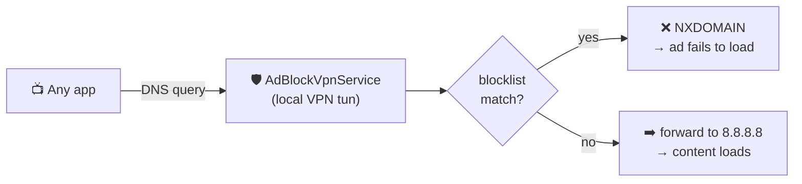

<p align="center">
  
</p>

<h1 align="center">Stream AdBlock — Fire TV App</h1>

<p align="center">
  <a href="https://github.com/deepak-glitch/adblock/actions/workflows/firetv-build.yml"></a>
  
  <a href="https://github.com/deepak-glitch/adblock/releases/tag/firetv-latest"></a>
  
</p>

A standalone Android TV / Fire TV app that blocks ads and trackers **at the DNS
level**, for **every app on the device** — no root, no PC, no subscription.

<p align="center">
  
</p>

---

## 📲 Install (≈ 2 minutes, no computer)

> ✅ **Fire OS** sticks only (2nd/3rd gen, 4K, 4K Max, Cube). ❌ Not 2025+ **Vega OS** — see [Compatibility](#-compatibility).

1. **Allow sideloading:** `Settings → My Fire TV → Developer options → Install unknown apps → Downloader → ON`
   *(No Developer options? `About` → highlight device name → press Select 7×.)*
2. **Install Downloader:** `Home → 🔍 → "Downloader"`.
3. **Sideload:** open Downloader → URL box → **`tinyurl.com/23hujy5w`** → **Go** → **Install**.
4. **Start:** open **Stream AdBlock** → **▶ Start Ad Blocking** → approve the VPN prompt → **Filter Lists → ⟳ Update**.

<details>
<summary>Alternative: install via ADB from a computer</summary>

```bash
# Fire TV: Settings → My Fire TV → Developer options → ADB debugging: ON
adb connect <fire-tv-ip>:5555
adb install -r app/build/outputs/apk/debug/app-debug.apk
```
</details>

---

## ✅ Compatibility

`Settings → My Fire TV → About → Software Version`:

| Shows… | OS | Sideload? |
|---|---|---|
| **Fire OS 7.x** (e.g. `7.7.1.3`) | Android-based | ✅ This app works |
| **Vega …** | Amazon's new Linux OS | ❌ No APKs — use the [network DNS server](../README.md#-other-ways-to-run-it) |

Minimum **API 22** (Fire OS 5 / Lollipop). `largeHeap` is enabled so the full
filter set fits even on 1 GB sticks (Fire TV Stick 3rd gen).

---

## 🎛️ Modes & features

| Feature | What it does |
|---|---|
| **VPN (Standalone)** | Default. A local VPN intercepts DNS on-device — no server needed. |
| **DNS Client** | Point Fire TV's DNS at a separate Stream AdBlock server; app is just a dashboard. |
| **Filter Lists** | Pulls uBO + EasyList + EasyPrivacy + AdGuard-DNS (tens of thousands of hosts); auto-refreshes daily; **⟳ Update** to refresh now. Falls back to bundled lists offline. |
| **Deep Blocking** *(experimental)* | Adds an HTTPS/SNI layer that catches ad hosts bypassing DNS via DoH/hardcoded IPs. ⚠️ Heavier; may affect streaming — **off by default**. |
| **Auto-start on boot** | Optional. |

---

## 🧱 What it blocks

The app bundles **300+ curated** ad/tracker domains and can pull the full
uBlock Origin / EasyList ecosystem on top. Blocking happens by **hostname**, so:

| Ad type | Blocked? |
|---|---|
| Third-party ad servers (DoubleClick, Freewheel, Google IMA) | ✅ |
| Trackers / analytics / telemetry | ✅ |
| **Max** ad-tier segments (`*.amer-free`, `litix.io`, `fwmrm.net`) | ✅ via the [HBO-Ads](https://github.com/ajstrick81/HBO-Ads) recipe — block ad hosts, keep `playback.api.discomax.com` |
| Truly frame-stitched in-stream ads (some Twitch/YouTube live) | ❌ same bytes as content |

> **Why uBlock Origin can't just be installed:** uBO is a *browser extension*;
> Fire TV has no extension-capable browser, and an extension can't see native
> apps anyway. This app is the right shape for a TV — it borrows uBO's *lists*.
> See [`ALTERNATIVES.md`](ALTERNATIVES.md) and [`SSAI.md`](SSAI.md).

---

## ⚙️ How VPN mode works



The app establishes a tiny private-IP VPN (`10.111.0.0/24`) and registers itself
as the DNS server. Android routes **only DNS** through it — all video traffic
flows normally over the real network, so streaming is never slowed. Each query's
`QNAME` is checked against the block/allow sets; ads get `NXDOMAIN`, everything
else is forwarded. Zero third-party deps — raw `DatagramSocket` + `ParcelFileDescriptor`.

---

## 🛠️ Troubleshooting

| Symptom | Fix |
|---|---|
| App won't connect / "communicating with the service" | Update to latest (backend host `bam.max.com` is allowlisted). |
| Max "Couldn't Play Content / Error 20000" | Update to latest — ad hosts blocked, `playback.api.discomax.com` allowed. |
| Some app stalls | Tap **■ Stop** to confirm it's the blocker, then report the app + error to allowlist its endpoint. |
| Streaming broke after **Deep Blocking** | Turn it OFF (experimental). |
| Ads return on Max later | Ad-edge host rotated — add it to `app/src/main/assets/lists/services/max-ssai-ads.txt`. |

---

## 📸 Screenshots

The dashboard above is an SVG mockup. **Real device captures** go in
[`../docs/img/`](../docs/img/) — see that folder's guide to add yours (it's a
drag-and-drop in the GitHub web UI), and they'll appear here.

---

## 🔨 Build

JDK 17 + Android SDK (API 34). Every push to `main` also builds in the cloud and
publishes the APK to the [`firetv-latest`](https://github.com/deepak-glitch/adblock/releases/tag/firetv-latest) release.

```bash
cd firetv
./gradlew assembleDebug      # → app/build/outputs/apk/debug/app-debug.apk
```

<details>
<summary>Project layout</summary>

```
firetv/app/src/main/
├── AndroidManifest.xml                 # permissions + VPN service + TV launcher
├── assets/lists/                       # bundled blocklists (mirror of root lists/)
│   └── services/max-ssai-ads.txt       # Max ad-segment hosts (HBO-Ads recipe)
├── java/com/streamadblock/firetv/
│   ├── MainActivity.kt                 # remote-friendly UI + stats
│   ├── BlocklistManager.kt             # parse + match (uBO/EasyList/hosts, @@ allow)
│   ├── FilterListUpdater.kt            # downloads + caches community lists
│   ├── Settings.kt · Stats.kt · BootReceiver.kt
│   └── vpn/
│       ├── AdBlockVpnService.kt        # VpnService packet loop (DNS + optional SNI)
│       ├── TcpProxy.kt                 # SNI proxy (Deep Blocking)
│       ├── DnsPacket.kt · IpPacket.kt · TcpPacket.kt
└── res/                                # layouts, drawables, strings, colors
```
</details>

---

## 🔐 Permissions

| Permission | Why |
|---|---|
| `INTERNET` | Forward DNS + download filter lists |
| `ACCESS_NETWORK_STATE` | Detect Wi-Fi changes |
| `BIND_VPN_SERVICE` | Host the VPN tun |
| `FOREGROUND_SERVICE` (+ `SPECIAL_USE`) | Keep the blocker alive |
| `RECEIVE_BOOT_COMPLETED` | Auto-start on boot (opt-in) |
| `POST_NOTIFICATIONS` | Persistent "running" notification |

No telemetry, no analytics, no accounts. The only outbound requests are the DNS
you allow and the filter-list downloads you trigger.

---

## ⚠️ Known limits

- **One VPN at a time** — conflicts with ExpressVPN/NordVPN etc.; use DNS Client mode then.
- **DoH apps bypass it** — apps with built-in DNS-over-HTTPS aren't visible (most streaming apps use plain DNS).
- **Frame-stitched SSAI** — where the ad is literally the same bytes as the show, DNS can't separate it (see [`SSAI.md`](SSAI.md)).
